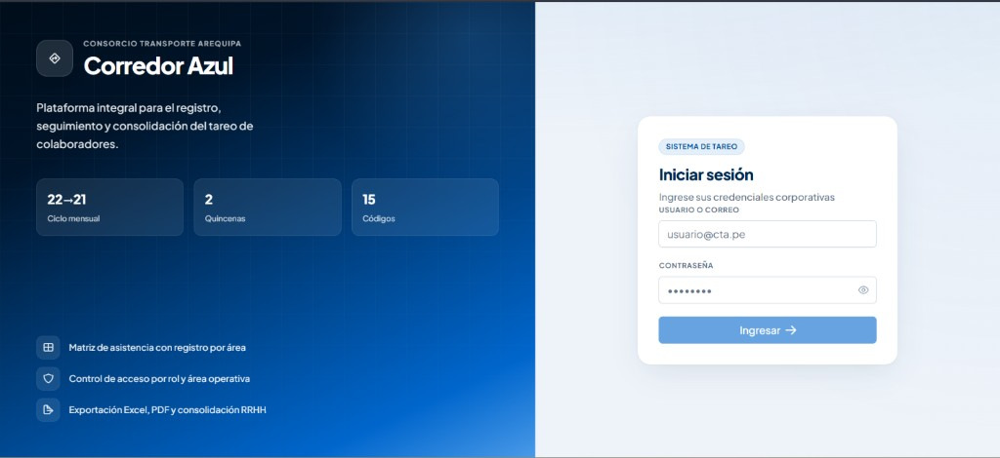

# Guía de instalación — Corredor Azul · Sistema de Tareo

Plataforma web para gestión de tareo y asistencia del **Consorcio Transporte Arequipa**.



## Inicio rápido (2 terminales)

### Terminal 1 — Backend

```powershell
cd back
mvn clean install -DskipTests
mvn spring-boot:run -pl bootstrap "-Dspring-boot.run.profiles=dev"
```

Espera: `Started TareoApplication`

- API: http://localhost:8080/api/v1
- Swagger: http://localhost:8080/swagger-ui.html

### Terminal 2 — Frontend

```powershell
cd front
npm install
npm start
```

Abre: http://localhost:4200

> Si `npm install` falla por proxy corporativo, el archivo `front/.npmrc` anula la config global de tu PC.

---

## Credenciales de prueba

| Usuario | Contraseña | Rol | Acceso |
|---------|------------|-----|--------|
| `admin` | `admin123` | RRHH | Todas las áreas |
| `shirley` | `admin123` | RRHH | RRHH + Liquidaciones |
| `responsable01` | `admin123` | Responsable | Área OPE |

Puedes iniciar sesión con **usuario** (`admin`) o **correo** si está en la base de datos.

---

## Requisitos

| Herramienta | Versión |
|-------------|---------|
| Java JDK | 21+ |
| Maven | 3.9+ |
| Node.js | 20+ |
| npm | 10+ |

No necesitas PostgreSQL en local: el perfil `dev` usa **H2 en memoria** con datos seed automáticos (Flyway).

---

## Verificar login (API)

Con el backend corriendo:

```powershell
curl -X POST http://localhost:8080/api/v1/auth/login ^
  -H "Content-Type: application/json" ^
  -d "{\"email\":\"admin\",\"password\":\"admin123\"}"
```

Respuesta esperada: JSON con `token`, `userId`, `nombre`, `email`, `rol`.

---

## Flujo de prueba en la app

1. Login como `admin`
2. **Períodos** → crear período (año + mes)
3. **Tareo** → elegir período y área → **Habilitar tareo**
4. Clic en celdas → asignar categoría (A, F, D, V, etc.)
5. **Culminar quincena**
6. **Reportes** → exportar Excel / PDF / TXT

---

## Estructura del proyecto

```
corredor-azul-tareo/
├── back/                 # API Spring Boot 3 (hexagonal)
├── front/                # Angular 21 + PrimeNG
├── docs/                 # Especificación, plantilla Excel, capturas
├── SETUP.md              # Esta guía
└── README.md
```

---

## Producción (Supabase)

1. Edita `back/.env` (ya creado con tu proyecto) y completa:
   - `DATABASE_PASSWORD` — contraseña de Postgres en Supabase
   - `SUPABASE_SECRET_KEY` — secret key completa
2. Arranca:

```powershell
cd back
mvn spring-boot:run -pl bootstrap "-Dspring-boot.run.profiles=prod"
```

Ver `back/.env.example` para todas las variables.

---

## Problemas frecuentes

| Problema | Solución |
|----------|----------|
| `mvn` no reconocido | Instalar Maven 3.9+ |
| Puerto 8080 ocupado | Cambiar `server.port` en `application-dev.yml` |
| Login falla en front | Verificar que backend esté en `:8080` |
| `ENOTFOUND` en npm | Revisar proxy en `C:\Users\PC\.npmrc` global |
| CORS | Backend ya permite `http://localhost:4200` |

---

## Tests backend

```powershell
cd back
mvn test
```

---

## Publicar en GitHub (compartir con el equipo)

El proyecto ya incluye la captura del login en `docs/screenshots/login-corredor-azul.png` y esta guía en `SETUP.md`.

1. Inicia sesión en GitHub CLI (una sola vez):

```powershell
gh auth login
```

2. Crea el repositorio público y sube el código:

```powershell
cd c:\Users\PC\Desktop\PROYECTOS\FATIMA
gh repo create corredor-azul-tareo --public --source=. --remote=origin --push
```

3. Comparte la URL que imprime `gh` (ej. `https://github.com/TU_USUARIO/corredor-azul-tareo`).

Si el remoto ya existe, solo haz push:

```powershell
git push -u origin main
```
